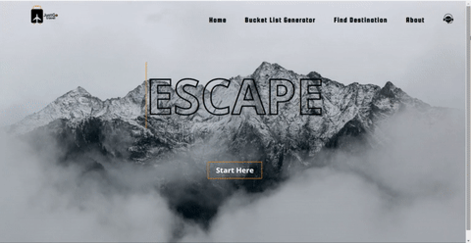

 JustGo Travel is the second project I created at <a href="https://perscholas.org/courses/software-engineer/software-engineer-atlanta/">Per Scholas'</a> Software Engineer Training using React.js. This is a fictitious website that focused on travel and utilizes the Fetch method and UseEffect hook to make a request to <a href= "https://developers.google.com/maps/documentation/places/web-service">Google Maps' Places Autocomplete API</a> and <a href= "https://api-ninjas.com/api/bucketlist">API Ninja's Bucket List</a>. This is the <a href= "https://travelapp-f8sm.onrender.com/">live link</a> for my React Application.

<h3>Application Features</h3>

The homepage features a navigation menu bar that creates an orange underline when users hover over a specific navigation link. In the far right corner is the support link, represented by a '24/7' headset icon. When clicked, this opens up the default email client suggesting that the user may receive support by sending an email to the 'mailto' link address.  

At the center of the homepage is the start button that leads users to the Bucket List Generator page. This page consists of three parts: Bucket List Generator, customer reviews, and the JustGo Travel's accolades.

<h4>API Ninjas Data Source</h4>

The first words on this page is a greeting to the user. There are several greeting options, namely, 'Good morning traveler', 'Good afternoon traveler', 'Good evening traveler', and 'Good night traveler'. The user is greeted with the greeting specific to their local time.

The heading prompts the user to be adventurous and click the 'Explore Now' button so that they can receive a bucklet list idea. This feature returns a random bucket list idea from <a href= "https://api-ninjas.com/api/bucketlist">API Ninjas</a>. When the user clicks the button, a yellow bucket appears on-screen and the idea is loaded above it. The bucket also consists of a button called, 'more adventure' which gives the user the opportunity to refresh the page, click the 'Explore Now' button again for another random bucket list idea.  

In addition, as the user begins to scroll 500 pixels away from the top of the page, a back to the top button is triggered so that users can use this shortcut, if needs be. This back to the top button is the JustGo Travel logo.

When users scroll downward, they are able to view the the customer reviews' section which is presented as a carousel with left and right arrows for direction. This carousel was created using an npm <a href="https://www.npmjs.com/package/react-elastic-carousel?activeTab=readme">react-elastic-carousel</a> package. Beneath the reviews' carousel is the company's awards and recoginition. This is displayed as a grid of three columns and the names of the fictitious companies (those that honored JustGo Travel) are included below. 

<h4>Google Maps' Places Autocomplete Data Source</h4>

This page consists of an Address Lookup feature in which users are able to type in a name of a place, anywhere in the world, and the table above the text input bar displays the latitude and longitude, as well as the address of the place. This was made possible by <a href= "https://www.npmjs.com/pack">Google Maps places library</a> which features a utility function to geocode and receive the latitude and longitude via Google Map's Geocoder API. Also, one can easily refresh their search by clicking the 'refresh search' button below the input bar.

The About navigation menu leads the users to a summary of the company's history. These paragraphs are placeholder text created by a <a href= "https://www.lipsum.com/">Lorem ipsum generator</a>. This page also features a photo grid layout of the employees at JustGo Travel and a section dedicated to partners of the company

<h3>Technologies used:</h3>
 <ul>
  <li>Scripting/Programming languages: <a href="https://react.dev/learn/writing-markup-with-jsx">JSX</a> and <a href="https://react.dev/">React.js</a>
  <li><a href="https://developer.chrome.com/docs/devtools/open/">Chrome DevTools</a></li>
  <li><a href= "https://developers.google.com/maps/documentation/places/web-service">Google Maps' Places Autocomplete API</a></li>
  <li><a href= "https://api-ninjas.com/api/bucketlist">API Ninja's Bucket List</a></li>
  <li><a href="https://render.com/">Render</a></li>
  <li><a href="https://www.figma.com/">Figma</a></li>
  <li><a href="https://docs.google.com/">Google Docs</a></li>
  <li><a href="https://code.visualstudio.com/">Visual Studio Code</a></li>
  <li><a href="https://github.com/">GitHub</a></li>
  <li><a href="https://coolors.co/">Coolors</a></li>
  <li><a href="https://www.lipsum.com/">Lorem Ipsum</a></li>
  <li><a href=https://www.adobe.com/products/illustrator.html">Adobe Illustrator</a></li>
  <li><a href="https://www.adobe.com/products/photoshop.html">Adobe Photoshop</a></li>
  <li><a href="https://www.flaticon.com/">Flaticon</a></li>
  <li><a href="https://www.freeconvert.com/video-compressor">Freeconvert</a></li>
  <li><a href="https://www.npmjs.com/package/pack">Npm Packages</a></li>
  <li><https://www.freepik.com/">Freepik</a></li>
  <li><a href="https://www.pexels.com/">Pexels</a></li>  
  <li><a href="https://tenor.com/">Tenor</a></li> 
 </ul>
 

<h3>Planning Process</h3>

Google docs was used to jot down ideas for this project. My wireframe was designed via Figma. The website's colors were sourced on Coolors; and animations were created via Adobe Photoshop and Illustrator, and some were sourced on Freepik.

<h3>Wireframe</h3>

<h3>Challenges</h3>
<ul>
<li>Sourcing an API that works, and does not require credit card payment</li>
<li>Linking images to display in the browser via the map method</li>
<li></li>
</ul>

<h3>Getting Started with Create React App</h3>

This project was bootstrapped with [Create React App](https://github.com/facebook/create-react-app).

## Available Scripts

In the project directory, you can run:

### `npm start`

Runs the app in the development mode.\
Open [http://localhost:3000](http://localhost:3000) to view it in your browser.

The page will reload when you make changes.\
You may also see any lint errors in the console.

### `npm test`

Launches the test runner in the interactive watch mode.\
See the section about [running tests](https://facebook.github.io/create-react-app/docs/running-tests) for more information.

### `npm run build`

Builds the app for production to the `build` folder.\
It correctly bundles React in production mode and optimizes the build for the best performance.

The build is minified and the filenames include the hashes.\
Your app is ready to be deployed!

See the section about [deployment](https://facebook.github.io/create-react-app/docs/deployment) for more information.

### `npm run eject`

**Note: this is a one-way operation. Once you `eject`, you can't go back!**

If you aren't satisfied with the build tool and configuration choices, you can `eject` at any time. This command will remove the single build dependency from your project.

Instead, it will copy all the configuration files and the transitive dependencies (webpack, Babel, ESLint, etc) right into your project so you have full control over them. All of the commands except `eject` will still work, but they will point to the copied scripts so you can tweak them. At this point you're on your own.

You don't have to ever use `eject`. The curated feature set is suitable for small and middle deployments, and you shouldn't feel obligated to use this feature. However we understand that this tool wouldn't be useful if you couldn't customize it when you are ready for it.

## Learn More

You can learn more in the [Create React App documentation](https://facebook.github.io/create-react-app/docs/getting-started).

To learn React, check out the [React documentation](https://reactjs.org/).

### Code Splitting

This section has moved here: [https://facebook.github.io/create-react-app/docs/code-splitting](https://facebook.github.io/create-react-app/docs/code-splitting)

### Analyzing the Bundle Size

This section has moved here: [https://facebook.github.io/create-react-app/docs/analyzing-the-bundle-size](https://facebook.github.io/create-react-app/docs/analyzing-the-bundle-size)

### Making a Progressive Web App

This section has moved here: [https://facebook.github.io/create-react-app/docs/making-a-progressive-web-app](https://facebook.github.io/create-react-app/docs/making-a-progressive-web-app)

### Advanced Configuration

This section has moved here: [https://facebook.github.io/create-react-app/docs/advanced-configuration](https://facebook.github.io/create-react-app/docs/advanced-configuration)

### Deployment

This section has moved here: [https://facebook.github.io/create-react-app/docs/deployment](https://facebook.github.io/create-react-app/docs/deployment)

### `npm run build` fails to minify

This section has moved here: [https://facebook.github.io/create-react-app/docs/troubleshooting#npm-run-build-fails-to-minify](https://facebook.github.io/create-react-app/docs/troubleshooting#npm-run-build-fails-to-minify)
